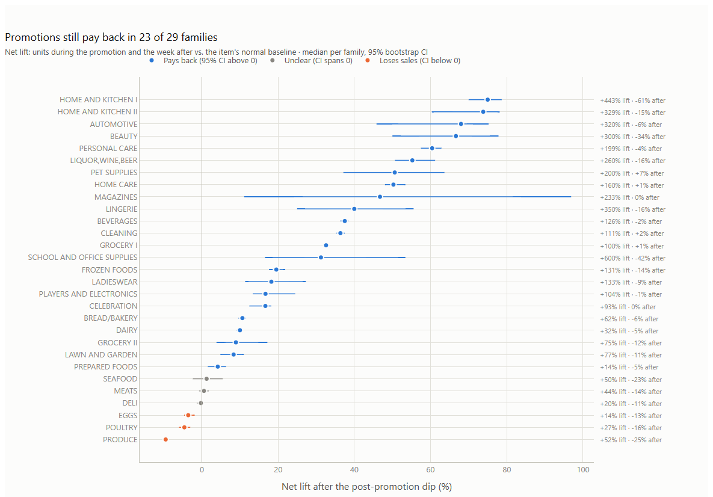
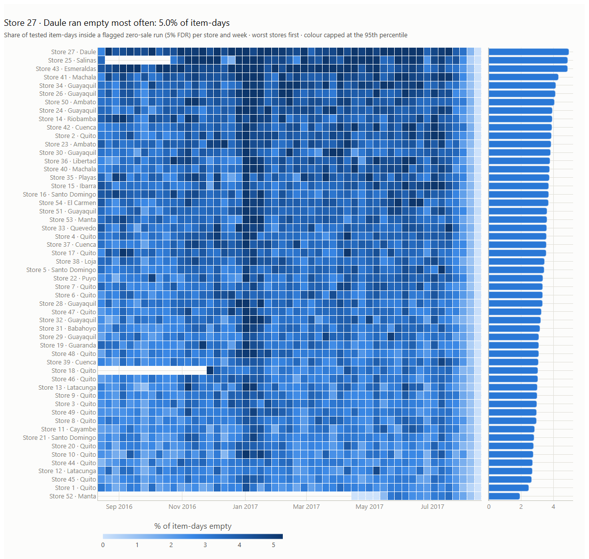
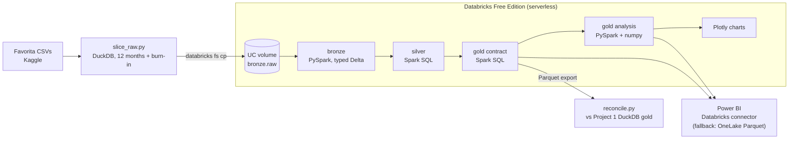

# Favorita stock-out & promo analysis on Databricks

[](https://github.com/zakaria17amir/favorita-stockout-promo-databricks/actions/workflows/ci.yml)

**PySpark + Spark SQL on Databricks Free Edition:** 12 months of real grocery sales flow through
bronze → silver → gold, and two questions get answered with statistics you can explain in one
sentence: *which zero-sale days are stock-outs?* and *what do promotions really add?* The gold
tables feed the Power BI [Store Performance Cockpit](https://github.com/zakaria17amir/store-performance-fabric).

> **Status:** the full year has run on Databricks Free Edition and reconciles with Project 1
> (see [reconciliation](docs/reconciliation.md)). Next: the deep-dive page in Project 1's Power BI report.

---

## Results

Databricks run over 2016-08-16 → 2017-08-15: 54 stores, 42.8M sales rows.

| | |
|---|---|
| Zero-sale runs tested | 5,736,166 |
| Flagged as stock-outs (5% false discovery rate) | **273,292 (4.8%)**. Plain Poisson would have flagged 1,233,125 (21.5%) |
| Benjamini–Hochberg cut-off | p ≤ 0.0024, so at most 13,664 of the flags are chance |
| Flagged runs | median 4 trading days; 110,164 store-items affected |
| Estimated lost units | 8.7M, about 2.8% of the 306M units sold |
| Promo events | 1,592,139; 19% have a promotion-free week after, so the dip can be measured |
| Median promo effect | **+59%** during, −6% the week after, **+19% net** |

**1. Promotions pay back in 23 of 29 families, but not in fresh food.** Eggs, poultry and produce *lose* sales
once the week after is counted, and seafood, meats and deli are too close to call. Every shelf-stable family
pays back.



**2. Stock-outs cluster by store and season.** Store 27 · Daule runs empty on 5.0% of item-days, the worst in the
network. Early January is the worst period for almost every store. Blank rows are weeks a store wasn't trading
(Store 52 opened in April 2017). The last 2–3 weeks read low because a run only counts once the item sells
again, so runs still open when the data ends can't be counted yet.



**3. Poisson is the wrong model for grocery demand.** 99% of store-items vary more than Poisson allows, and that
is why a negative binomial cuts the flag rate from 21.5% to 4.8%
([chart](docs/charts/poisson_check.png), [ADR-003](docs/decisions/ADR-003-negative-binomial-run-test.md)).

**4. Holidays and paydays inflate promo uplift in 16 of 28 families,** but the effect is small except in school and
office supplies, which is more likely back-to-school timing than paydays ([chart](docs/charts/payday_check.png)).
Uplift by family, with confidence intervals: [chart](docs/charts/uplift_by_family.png).

**5. The rebuild matches Project 1.** The same 37,358,381 sales rows and 306,343,235.16 units, and identical
promotion baselines. The small differences in stock-out flags all come from the shorter history of a 12-month
slice ([reconciliation](docs/reconciliation.md)).

Every chart is in [`docs/charts/`](docs/charts/) as interactive HTML with a PNG beside it.

## The questions

| Who | Question | Answer in this repo |
|---|---|---|
| Store manager | Which items were probably out of stock, and for how long? | `fact_stockout_run`: zero-sale runs that are too unlikely to be chance |
| Category manager | Which promotions really lifted sales, and what did they cost the week after? | `fact_promo_event` + `promo_family_summary`: uplift and post-promo dip with confidence intervals |

## The statistics, in plain words

**Stock-outs, without machine learning.** If an item normally sells λ units a day, how likely is it
to sell nothing at all for *k* trading days in a row? If that's very unlikely, something is wrong on the shelf.

- The textbook answer is Poisson: `p = e^(−λk)`. But real grocery demand is lumpy. On Favorita the variance is
  higher than the mean for 99% of store-items, so zero days happen far more often than Poisson expects. Over the
  full year, Poisson flagged **21.5%** of all tested zero-sale runs.
- So the test uses a **negative binomial**: the same mean λ, plus the item's own dispersion φ = variance ÷ mean,
  both from the previous 28 trading days. A zero day then has probability `φ^(−λ/(φ−1))`, and a run of k days
  has that to the power k. It flags **4.8%**. It's one extra number per item and still explainable in a
  sentence. When φ ≤ 1 it's exactly Poisson. The Poisson p-value is kept next to it for comparison. See [ADR-003](docs/decisions/ADR-003-negative-binomial-run-test.md).
- A run only counts if the item **sells again afterwards**, within 28 trading days. A gap that never
  ends is a delisting, not a stock-out.
- Days when the store traded at less than half its normal footfall don't count as evidence.
- **We test millions of runs**, so a plain 5% cut-off would flag thousands by chance. We use
  **Benjamini–Hochberg**: *of the runs we flag, at most 5% are expected to be chance.*
- **Still assumed:** days are independent. Real stock-outs cluster (one empty shelf lasts), which is fine for
  flagging, but it means the p-values shouldn't be read as exact probabilities.

**Promo uplift.** A promo event is a run of consecutive promotion days for one item in one store.
It's compared with the item's normal rate: its average over the previous 28 trading days, excluding promotion days.

- Uplift = actual units ÷ (baseline × days) − 1.
- Post-promo dip = the same comparison over the 7 days after the event (customers who stocked up buy less).
  It's only measured when the following week is promotion-free. On Favorita the next promotion often starts
  within 7 days, so about 1 in 5 events (19%) has a clean week. The rest would mix the dip with the next lift.
- **Net lift** = (units during the promotion + the week after) ÷ the baseline for both − 1. A promotion that only
  pulled sales forward nets out near zero, so this answers *did it pay back?*
- Each family gets the **median** uplift with a **bootstrap 95% confidence interval** (1,000 resamples of events).
- **Known bias:** promotions that fall on holidays or paydays (the 15th and the month-end) look better than
  they are. A check chart splits them out.

## What it demonstrates

| Capability | How | Status |
|---|---|---|
| Databricks | Free Edition: serverless notebooks, Unity Catalog, volumes, Delta tables | Full year run |
| PySpark | Bronze load, run detection with window functions, BH ranking, promo events | Built and tested |
| Spark SQL | Silver and gold contract tables, ported from Project 1's DuckDB SQL | Built, parity-tested |
| Statistics | Negative-binomial run test (vs. Poisson), Benjamini–Hochberg FDR, bootstrap CIs | Built and tested |
| Plotly | Uplift and net payback with CIs, holiday/payday check, stock-out rate heatmap, overdispersion check | Built, see [Results](#results) |
| Testing | pytest on local Spark; Project 1's fixture must give the same numbers as Project 1 | Built |
| Interoperability | Same table contract as Project 1, reconciled row by row; Power BI via the Databricks connector | Reconciled; connector tested |

## Architecture



| Layer | Tables | Language |
|---|---|---|
| bronze | `train`, `transactions`, `stores`, `items`, `holidays_events` | PySpark |
| silver | `sales`, `store_day`, `national_holidays` | Spark SQL |
| gold, contract (same as Project 1) | `dim_date`, `stg_store`, `stg_item`, `stg_store_day`, `fact_sales`, `fact_stockout_risk` | Spark SQL |
| gold, analysis | `fact_stockout_run`, `fact_promo_event`, `promo_family_summary` | PySpark, numpy |

**Window:** 2016-08-16 → 2017-08-15 (the last 12 months of the data), plus 56 days of burn-in
before it so every trailing average is complete on day one. The raw files are date-sliced
locally because Free Edition has a daily compute cap. The rows are otherwise untouched.

The full design is in the [spec](docs/superpowers/specs/2026-09-26-stockout-promo-databricks-design.md). Decisions:
[ADR-001 Free Edition and the slice](docs/decisions/ADR-001-free-edition-and-slice.md) ·
[ADR-002 Power BI link](docs/decisions/ADR-002-power-bi-link.md) ·
[ADR-003 Negative-binomial run test](docs/decisions/ADR-003-negative-binomial-run-test.md).

## Repository layout

```
src/favorita_spark/   pipeline code: config, runner, bronze, SQL files, stock-out runs, promo events, charts
notebooks/            Databricks notebooks 00–07 (thin runners that import src/)
scripts/              slice_raw.py (local DuckDB slice), reconcile.py (vs Project 1)
tests/                pytest on local Spark, including parity with Project 1's fixture
docs/                 spec, plan, decisions, charts, reconciliation
```

## Run it

### Tests (local, no Databricks needed)

Requires Python 3.11–3.13 and Java 17 or 21. Java 23 also works: the test session passes
`-Djava.security.manager=allow`. On Windows no winutils is needed, because local tests use temp views instead of tables.

```bash
python -m venv .venv
.venv/Scripts/python -m pip install -e ".[dev]"
.venv/Scripts/python -m pytest
```

### On Databricks Free Edition

1. Sign up at [databricks.com/learn/free-edition](https://www.databricks.com/learn/free-edition).
2. Create a Git folder in the workspace that points at this repo.
3. Run `notebooks/00_setup` once. It creates the schemas and volumes, and a table for the Power BI connector test.
4. Slice the raw data locally (needs the Kaggle files from Project 1). This gives 42.8M sales rows and a 297 MB `train.csv.gz`:

   ```bash
   .venv/Scripts/python scripts/slice_raw.py --raw ../Flagship/data/raw --out data/slice
   ```

   Upload the five `.csv.gz` files to the `workspace.bronze.raw` volume, either in the UI (Catalog → volume →
   *Upload*, 5 GB per file; select the five files, not the folder) or with the [Databricks CLI](https://docs.databricks.com/dev-tools/cli/install.html):
   `for f in data/slice/*.csv.gz; do databricks fs cp "$f" dbfs:/Volumes/workspace/bronze/raw/ --overwrite; done`.
5. Run `01` → `07` in order on serverless compute.
6. Download the export and reconcile it against Project 1:

   ```bash
   databricks fs cp -r dbfs:/Volumes/workspace/gold/export data/export --overwrite
   .venv/Scripts/python scripts/reconcile.py --export data/export --flagship ../Flagship/data/full/gold
   ```

## Roadmap

- [x] Pipeline, statistics and charts, tested on local Spark
- [x] Full-year run on Databricks Free Edition, within the daily compute cap
- [x] Reconciliation against Project 1: all checks pass ([report](docs/reconciliation.md))
- [x] Power BI connection test: token login works on Free Edition via the Azure Databricks connector ([ADR-002](docs/decisions/ADR-002-power-bi-link.md))
- [x] Results and charts in this README
- [ ] Stock-out and promo deep-dive page in Project 1's Power BI report

## Data

[Corporación Favorita Grocery Sales Forecasting](https://www.kaggle.com/c/favorita-grocery-sales-forecasting)
(Kaggle). The data isn't redistributed here: accept the competition rules and download it yourself.
