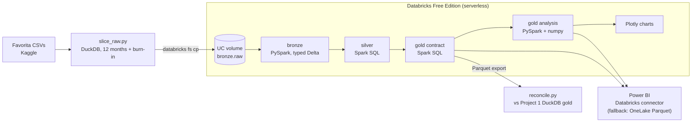

# Favorita stock-out & promo analysis on Databricks

[](https://github.com/zakaria17amir/favorita-stockout-promo-databricks/actions/workflows/ci.yml)

**PySpark + Spark SQL on Databricks Free Edition:** 12 months of real grocery sales flow through
bronze → silver → gold, and two questions get answered with statistics you can explain in one
sentence: *which zero-sale days are stock-outs?* and *what do promotions really add?* The gold
tables feed the Power BI [Store Performance Cockpit](https://github.com/zakaria17amir/store-performance-fabric).

> **Status: in progress.** The pipeline, the statistics and the charts are built and tested
> locally on Spark. The first Databricks run, the reconciliation against Project 1 and the
> Power BI connection are next (see [Roadmap](#roadmap)).

---

## The questions

| Who | Question | Answer in this repo |
|---|---|---|
| Store manager | Which items were probably out of stock, and for how long? | `fact_stockout_run`: zero-sale runs that are too unlikely to be chance |
| Category manager | Which promotions really lifted sales, and what did they cost the week after? | `fact_promo_event` + `promo_family_summary`: uplift and post-promo dip with confidence intervals |

## The statistics, in plain words

**Stock-outs, without machine learning.** If an item normally sells λ units a day, how likely is it
to sell nothing at all for *k* trading days in a row? If that's very unlikely, something is wrong on the shelf.

- The textbook answer is Poisson: `p = e^(−λk)`. But real grocery demand is lumpy. On Favorita the variance is
  about **4× the mean**, so zero days happen far more often than Poisson expects. On a real 3-store trial,
  Poisson flagged **38%** of all zero-sale runs.
- So the test uses a **negative binomial**: the same mean λ, plus the item's own dispersion φ = variance ÷ mean,
  both from the previous 28 trading days. A zero day then has probability `φ^(−λ/(φ−1))`, and a run of k days
  has that to the power k. On the same trial it flags **11.4%**. It's one extra number per item and still
  explainable in a sentence. When φ ≤ 1 it's
  exactly Poisson. The Poisson p-value is kept next to it for comparison. See [ADR-003](docs/decisions/ADR-003-negative-binomial-run-test.md).
- A run only counts if the item **sells again afterwards**, within 28 trading days. A gap that never
  ends is a delisting, not a stock-out.
- Days when the store traded at less than half its normal footfall don't count as evidence.
- **We test millions of runs**, so a plain 5% cut-off would flag thousands by chance. We use
  **Benjamini–Hochberg**: *of the runs we flag, at most 5% are expected to be chance.*
- **Still assumed:** days are independent. Real stock-outs cluster (one empty shelf lasts), which is fine for
  flagging, but it means the p-values shouldn't be read as exact probabilities.

**Promo uplift.** A promo event is a run of consecutive promotion days for one item in one store.
It's compared with the item's normal rate: its average over the previous 28 trading days, excluding promotion days.

- Uplift = actual units ÷ (baseline × days) − 1.
- Post-promo dip = the same comparison over the 7 days after the event (customers who stocked up buy less).
  It's only measured when the following week is promotion-free. On Favorita the next promotion often starts
  within 7 days, so about 1 in 6 events has a clean week. The rest would mix the dip with the next lift.
- Each family gets the **median** uplift with a **bootstrap 95% confidence interval** (1,000 resamples of events).
- **Known bias:** promotions that fall on holidays or paydays (the 15th and the month-end) look better than
  they are. A check chart splits them out.

## What it demonstrates

| Capability | How | Status |
|---|---|---|
| Databricks | Free Edition: serverless notebooks, Unity Catalog, volumes, Delta tables | Built, first run pending |
| PySpark | Bronze load, run detection with window functions, BH ranking, promo events | Built and tested |
| Spark SQL | Silver and gold contract tables, ported from Project 1's DuckDB SQL | Built, parity-tested |
| Statistics | Negative-binomial run test (vs. Poisson), Benjamini–Hochberg FDR, bootstrap CIs | Built and tested |
| Plotly | Uplift with CIs, uplift vs. dip, holiday/payday check, stock-out heatmap, overdispersion check | Built |
| Testing | pytest on local Spark; Project 1's fixture must give the same numbers as Project 1 | Built |
| Interoperability | Same table contract as Project 1, reconciled row by row; Power BI via the Databricks connector | Connector tested; reconciliation pending |

## Architecture



| Layer | Tables | Language |
|---|---|---|
| bronze | `train`, `transactions`, `stores`, `items`, `holidays_events` | PySpark |
| silver | `sales`, `store_day`, `national_holidays` | Spark SQL |
| gold, contract (same as Project 1) | `dim_date`, `stg_store`, `stg_item`, `stg_store_day`, `fact_sales`, `fact_stockout_risk` | Spark SQL |
| gold, analysis | `fact_stockout_run`, `fact_promo_event`, `promo_family_summary` | PySpark, numpy |

**Window:** 2016-08-16 → 2017-08-15 (the last 12 months of the data), plus 56 days of burn-in
before it so every trailing average is complete on day one. The raw files are date-sliced
locally because Free Edition has a daily compute cap. The rows are otherwise untouched.

The full design is in the [spec](docs/superpowers/specs/2026-09-26-stockout-promo-databricks-design.md). Decisions:
[ADR-001 Free Edition and the slice](docs/decisions/ADR-001-free-edition-and-slice.md) ·
[ADR-002 Power BI link](docs/decisions/ADR-002-power-bi-link.md).

## Repository layout

```
src/favorita_spark/   pipeline code: config, runner, bronze, SQL files, stock-out runs, promo events, charts
notebooks/            Databricks notebooks 00–07 (thin runners that import src/)
scripts/              slice_raw.py (local DuckDB slice), reconcile.py (vs Project 1)
tests/                pytest on local Spark, including parity with Project 1's fixture
docs/                 spec, plan, decisions, charts, reconciliation
```

## Run it

### Tests (local, no Databricks needed)

Requires Python 3.11–3.13 and Java 17 or 21. Java 23 also works: the test session passes
`-Djava.security.manager=allow`. On Windows no winutils is needed, because local tests use temp views instead of tables.

```bash
python -m venv .venv
.venv/Scripts/python -m pip install -e ".[dev]"
.venv/Scripts/python -m pytest
```

### On Databricks Free Edition

1. Sign up at [databricks.com/learn/free-edition](https://www.databricks.com/learn/free-edition).
2. Create a Git folder in the workspace that points at this repo.
3. Run `notebooks/00_setup` once. It creates the schemas and volumes, and a table for the Power BI connector test.
4. Slice the raw data locally (needs the Kaggle files from Project 1). This gives 42.8M sales rows and a 297 MB `train.csv.gz`:

   ```bash
   .venv/Scripts/python scripts/slice_raw.py --raw ../Flagship/data/raw --out data/slice
   ```

   Upload the five `.csv.gz` files to the `workspace.bronze.raw` volume, either in the UI (Catalog → volume →
   *Upload*, 5 GB per file; select the five files, not the folder) or with the [Databricks CLI](https://docs.databricks.com/dev-tools/cli/install.html):
   `for f in data/slice/*.csv.gz; do databricks fs cp "$f" dbfs:/Volumes/workspace/bronze/raw/ --overwrite; done`.
5. Run `01` → `07` in order on serverless compute.
6. Download the export and reconcile it against Project 1:

   ```bash
   databricks fs cp -r dbfs:/Volumes/workspace/gold/export data/export --overwrite
   .venv/Scripts/python scripts/reconcile.py --export data/export --flagship ../Flagship/data/full/gold
   ```

## Roadmap

- [x] Pipeline, statistics and charts, tested on local Spark
- [ ] First run on Databricks Free Edition (runtimes, daily-cap notes)
- [ ] Reconciliation against Project 1 → `docs/reconciliation.md`
- [x] Power BI connection test: token login works on Free Edition via the Azure Databricks connector ([ADR-002](docs/decisions/ADR-002-power-bi-link.md))
- [ ] Results table and chart screenshots in this README

## Data

[Corporación Favorita Grocery Sales Forecasting](https://www.kaggle.com/c/favorita-grocery-sales-forecasting)
(Kaggle). The data isn't redistributed here: accept the competition rules and download it yourself.
